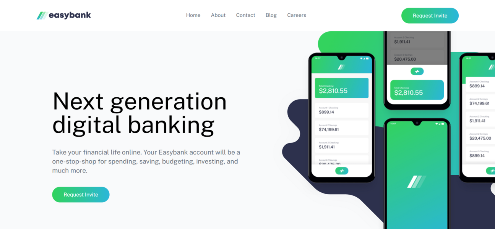
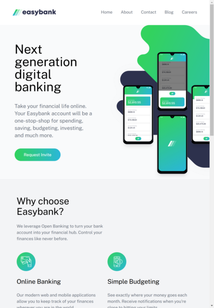
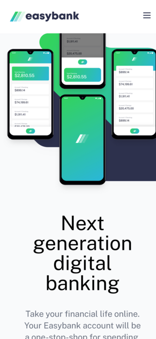

# Easybank

**Easybank** is a simple landing page project built to practice Tailwind CSS, React, and TypeScript, focusing on responsive design and modern web development practices.

 

## Features
- **Responsive Layout**
- **Semantic Markup**
- **Utility-first styling**
- **Component-based approach to UI development.**

## Built With
- **React**
- **TypeScript**
- **Tailwind CSS**
- **HTML5**.
- **Grid & Flexbox**

